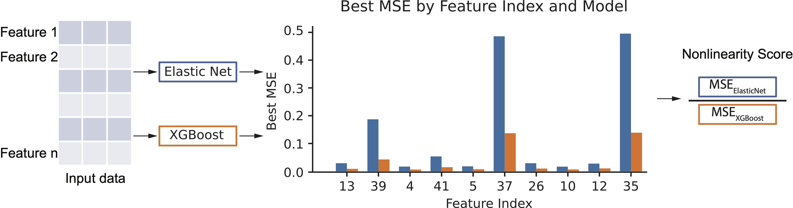
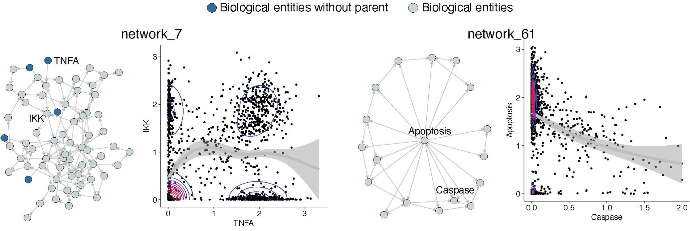
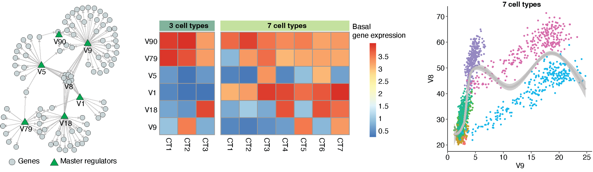
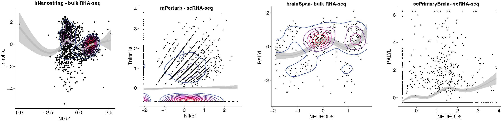

# NonlinearCausal
 In this paper we evaluated linear and non-linear versions of widely used CD approaches across a wide range of datasets using ODE based simulations to real biological data.

## Nonlinearity in data

### Nonlinearity in simulated data


### Nonlinearity in bulk and sc-RNA-seq data



## Causal discovery methods
All code are available [here](https://github.com/zhu-yh1/NonlinearCausal/tree/main/code/causal_discovery_algorithms)
### [DAGMA](https://github.com/kevinsbello/dagma)
```
# linear DAGMA
python -u DAGMA.py -i $inputFile \
                -o $outputFile \
                --lambda1=$lambda1 \
                --w_threshold=0 \
                --time_path=$runtimeOutput \
                --zscore

# non-linear DAGMA
python -u DAGMAnonLinear.py -i $inputFile \
                -o $outputFile \
                --lambda1=$lambda2 \
                --lambda2=$lambda2 \
                --time_path=$runtimeOutput \
                --w_threshold=0 \
                --zscore
```
### [NOTEARS](https://github.com/xunzheng/notears)
We edited the original NOTEARS implementation for user-defined parameter input. Please download and install notears from [our repository](https://github.com/zhu-yh1/NonlinearCausal/tree/main/code/causal_discovery_algorithms/notears) to use the following command line tool for NOTEARS
```
# linear NOTEARS
notears_linear $inputFile \
                --lambda1=$lambda1 \
                --W_path=$outputFile \
                --w_threshold=0 \
                --runtime \
                --time_path=$runtimeOutput \
                --zscore

# non-linear NOTEARS
notears_nonlinear $inputFile \
                --lambda1=$lambda1 \
                --lambda2=$lambda2 \
                --W_path=$outputFile \
                --runtime \
                --time_path=$runtimeOutput \
                --zscore
```
### PC
```
# linear PC
Rscript PC.R -i $inputFile \
                -o $outputFile \
                --alpha=$alpha \
                --time_path=$runtimeOutput \
                --zscore=TRUE

# non-linear PC (PC_rcit)
python -u PC_rcit.py -i $inputFile \
                -o $outputFile \
                --alpha=$alpha \
                --CItest="rcit" \
                --time_path=$runtimeOutput \
                --zscore
```
